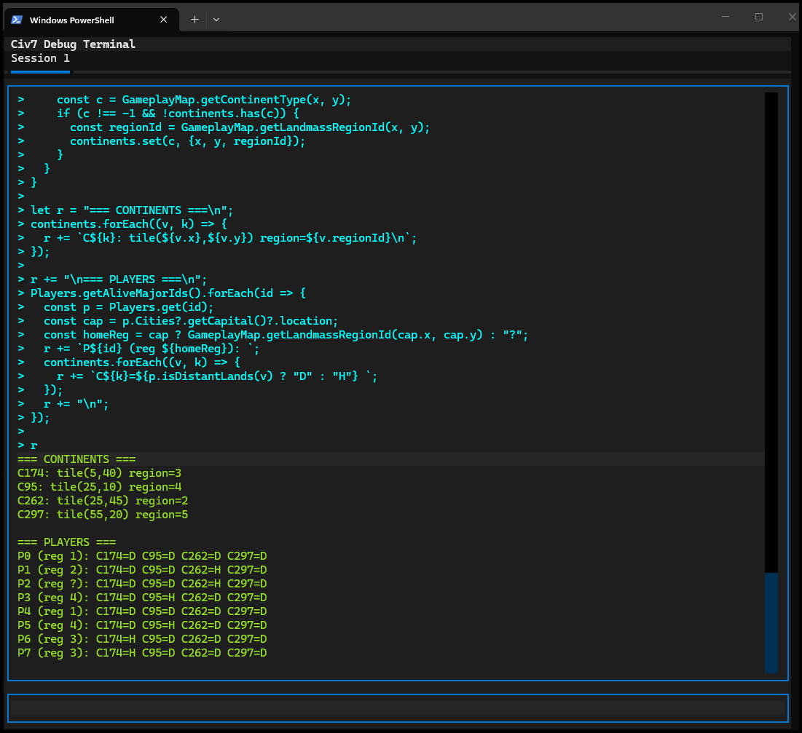

# Civ7 FireTuner Terminal

A proper terminal for Civilization 7's debug port, because the built-in one just wasn't cutting it.

## Why I Built This

Civ 7 ships with a debug console called FireTuner - lets you run JavaScript commands against the game engine. Cool, right? Except the actual terminal UI is... barebones. No command history, no multiline support, can't even copy text properly. If you're doing any serious poking around, you end up fighting the tool more than the game.

So I built my own.



## The Protocol

Firaxis didn't document this anywhere (that I could find), so I had to reverse engineer it. Fired up Wireshark and watched the traffic:


Turns out it's pretty simple - binary messages over TCP on port 4318:

**Sending commands:**
```
[4 bytes: length, little-endian]
[4 bytes: type=3, little-endian]
[CMD:65535:{your javascript here}\0]
```

**Receiving responses:**
```
[4 bytes: length, little-endian]
[4 bytes: type=3, little-endian]
[{result}\0]
```

The `CMD:65535:` prefix is some kind of command identifier - 65535 might be a player ID or session thing. The message type is always 3 for command/response pairs. Everything's null-terminated.

## Features

What you get that FireTuner doesn't give you:

- **Command history** - Up/Down arrows, like a real terminal
- **Multiline editing** - Write actual code, not one-liners
- **Smart continuation** - Detects unclosed brackets/quotes and auto-continues
- **Copy/paste that works** - Select text, Ctrl+C to copy
- **Multiple tabs** - Different sessions for different experiments
- **Session logging** - Everything gets saved to disk
- **Auto-reconnect** - Game crashed? Terminal reconnects when you restart
- **Pretty JSON** - Responses get formatted so you can actually read them

## Installation

### Windows

```powershell
git clone https://github.com/ghost-ng/FiretunerTerminal.git
cd FiretunerTerminal

python -m venv venv
.\venv\Scripts\Activate.ps1

pip install -r requirements.txt
```

### Linux/Mac

```bash
git clone https://github.com/ghost-ng/FiretunerTerminal.git
cd FiretunerTerminal

python3 -m venv venv
source venv/bin/activate

pip install -r requirements.txt
```

## Enable FireTuner in Civ 7

Edit your `AppOptions.txt` file and set `EnableTuner` to `1`:

**Windows:** `%LOCALAPPDATA%\Firaxis Games\Sid Meier's Civilization VII\AppOptions.txt`

Find this line and change it:
```
EnableTuner 1
```

Restart the game after making this change.

## Usage

With FireTuner enabled and Civ 7 running:

```bash
# Windows (with venv activated)
python -m civ7_terminal

# Linux/Mac (with venv activated)
python3 -m civ7_terminal
```

Just type JavaScript and hit Enter:

```javascript
GameplayMap.getGridWidth()
```

For multiline stuff, the terminal auto-continues when you have unclosed brackets:

```javascript
// Find all continents with sample tiles
const continents = new Map();
const w = GameplayMap.getGridWidth();
const h = GameplayMap.getGridHeight();
for (let x = 0; x < w; x += 5) {
  for (let y = 0; y < h; y += 5) {
    const c = GameplayMap.getContinentType(x, y);
    if (c !== -1 && !continents.has(c)) {
      const regionId = GameplayMap.getLandmassRegionId(x, y);
      continents.set(c, {x, y, regionId});
    }
  }
}

// Build result string
let r = "=== CONTINENTS ===\n";
continents.forEach((v, k) => {
  r += `C${k}: tile(${v.x},${v.y}) region=${v.regionId}\n`;
});

r += "\n=== PLAYERS ===\n";
Players.getAliveMajorIds().forEach(id => {
  const p = Players.get(id);
  const cap = p.Cities?.getCapital()?.location;
  const homeReg = cap ? GameplayMap.getLandmassRegionId(cap.x, cap.y) : "?";
  r += `P${id} (reg ${homeReg}): `;
  continents.forEach((v, k) => {
    r += `C${k}=${p.isDistantLands(v) ? "D" : "H"} `;
  });
  r += "\n";
});

r
```

The last line `r` returns the built string. Or force a newline with `Ctrl+Enter`.

## Keybindings

| Key | What it does |
|-----|--------------|
| Enter | Run command (auto-continues if syntax incomplete) |
| Ctrl+Enter | Force newline |
| Up/Down | Command history |
| Ctrl+C | Copy / Cancel |
| Ctrl+L | Clear screen |
| Ctrl+T | New tab |
| Ctrl+W | Close tab |
| Ctrl+D | Exit |

## Colors

- **Cyan** - Your commands
- **Green** - Responses from the game
- **Red** - Errors
- **Yellow** - Info messages

## CLI Options

```
--host, -H     Debug server host (default: 127.0.0.1)
--port, -p     Debug server port (default: 4318)
--session-dir  Where to save session logs (default: ./sessions)
```

## Requirements

- Python 3.10+
- Civ 7 running with debug enabled
- That's it

## License

Do whatever you want with it.
