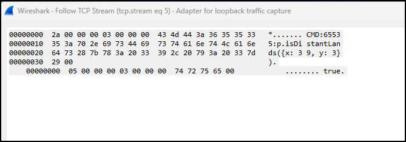

# Civ7 FireTuner Terminal

A proper terminal for Civilization 7's debug port, because the built-in one just wasn't cutting it.

## Why I Built This

Civ 7 ships with a debug console called FireTuner - lets you run JavaScript commands against the game engine. Cool, right? Except the actual terminal UI is... barebones. No command history, no multiline support, can't even copy text properly. If you're doing any serious poking around, you end up fighting the tool more than the game.

So I built my own.


## The Protocol

Firaxis didn't document this anywhere (that I could find), so I had to reverse engineer it. Fired up Wireshark and watched the traffic:



Turns out it's pretty simple - binary messages over TCP on port 4318:

**Sending commands:**
```
[4 bytes: length, little-endian]
[4 bytes: type=3, little-endian]
[CMD:65535:{your javascript here}\0]
```

**Receiving responses:**
```
[4 bytes: length, little-endian]
[4 bytes: type=3, little-endian]
[{result}\0]
```

The `CMD:65535:` prefix is some kind of command identifier - 65535 might be a player ID or session thing. The message type is always 3 for command/response pairs. Everything's null-terminated.

## Features

What you get that FireTuner doesn't give you:

- **Command history** - Up/Down arrows, like a real terminal
- **Multiline editing** - Write actual code, not one-liners
- **Smart continuation** - Detects unclosed brackets/quotes and auto-continues
- **Copy/paste that works** - Select text, Ctrl+C to copy
- **Multiple tabs** - Different sessions for different experiments
- **Session logging** - Everything gets saved to disk
- **Auto-reconnect** - Game crashed? Terminal reconnects when you restart
- **Pretty JSON** - Responses get formatted so you can actually read them

## Installation

### Windows

```powershell
git clone https://github.com/ghost-ng/FiretunerTerminal.git
cd FiretunerTerminal

python -m venv venv
.\venv\Scripts\Activate.ps1

pip install -r requirements.txt
```

### Linux/Mac

```bash
git clone https://github.com/ghost-ng/FiretunerTerminal.git
cd FiretunerTerminal

python3 -m venv venv
source venv/bin/activate

pip install -r requirements.txt
```

## Enable FireTuner in Civ 7

Edit your `AppOptions.txt` file and set `EnableTuner` to `1`:

**Windows:** `%LOCALAPPDATA%\Firaxis Games\Sid Meier's Civilization VII\AppOptions.txt`

Find this line and change it:
```
EnableTuner 1
```

Restart the game after making this change.

## Usage

With FireTuner enabled and Civ 7 running:

```bash
# Windows (with venv activated)
python -m civ7_terminal

# Linux/Mac (with venv activated)
python3 -m civ7_terminal
```

Just type JavaScript and hit Enter:

```javascript
GameplayMap.getGridWidth()
```

For multiline stuff, the terminal auto-continues when you have unclosed brackets:

```javascript
// Find all continents with sample tiles
const continents = new Map();
const w = GameplayMap.getGridWidth();
const h = GameplayMap.getGridHeight();
for (let x = 0; x < w; x += 5) {
  for (let y = 0; y < h; y += 5) {
    const c = GameplayMap.getContinentType(x, y);
    if (c !== -1 && !continents.has(c)) {
      const regionId = GameplayMap.getLandmassRegionId(x, y);
      continents.set(c, {x, y, regionId});
    }
  }
}

// Build result string
let r = "=== CONTINENTS ===\n";
continents.forEach((v, k) => {
  r += `C${k}: tile(${v.x},${v.y}) region=${v.regionId}\n`;
});

r += "\n=== PLAYERS ===\n";
Players.getAliveMajorIds().forEach(id => {
  const p = Players.get(id);
  const cap = p.Cities?.getCapital()?.location;
  const homeReg = cap ? GameplayMap.getLandmassRegionId(cap.x, cap.y) : "?";
  r += `P${id} (reg ${homeReg}): `;
  continents.forEach((v, k) => {
    r += `C${k}=${p.isDistantLands(v) ? "D" : "H"} `;
  });
  r += "\n";
});

r
```

The last line `r` returns the built string. Or force a newline with `Ctrl+Enter`.

## Keybindings

| Key | What it does |
|-----|--------------|
| Enter | Run command (auto-continues if syntax incomplete) |
| Ctrl+Enter | Force newline |
| Up/Down | Command history |
| Ctrl+C | Copy / Cancel |
| Ctrl+L | Clear screen |
| Ctrl+T | New tab |
| Ctrl+W | Close tab |
| Ctrl+D | Exit |

## Colors

- **Cyan** - Your commands
- **Green** - Responses from the game
- **Red** - Errors
- **Yellow** - Info messages

## JavaScript API Library

The Civ 7 debug console exposes a rich JavaScript API. The methods and objects are visible in the game's JS files, but there's no single reference that pulls it all together — so we built one. **[`API_LIBRARY.md`](API_LIBRARY.md)** is a community-driven quick reference covering `GameplayMap`, `Players`, `Game`, cities, units, diplomacy, and more. Saves you from digging through game files every time you need a method signature.

If you're an AI agent or a human poking around, start there. If you discover something new, [open a PR](https://github.com/ghost-ng/FiretunerTerminal/pulls) to add it.

## MCP Server (AI Agent Access)

Want to let Claude, Cursor, or other AI agents send commands to Civ 7? There's an MCP server built in.

### Running It

```bash
# stdio transport (default) - for Claude Desktop, Cursor, Claude Code
python -m civ7_terminal.mcp_server

# Streamable HTTP - for remote access or multiple clients
python -m civ7_terminal.mcp_server --transport streamable-http --http-port 8080
```

It runs as a separate process from the terminal UI - both can be open at the same time.

### Claude Code / Cursor Setup

Drop a `.mcp.json` in any project root where you want agents to have access to Civ 7. Two example configs are provided:

- **[`examples/mcp-venv.json`](examples/mcp-venv.json)** - Use this if you installed dependencies in a virtual environment. Points directly to the venv's Python so packages are found without activating.
- **[`examples/mcp-global.json`](examples/mcp-global.json)** - Use this if you installed dependencies globally (system Python). Uses plain `python` as the command.

Copy whichever fits your setup to `.mcp.json` in your project root, then update the paths to match where you cloned FiretunerTerminal. On Linux/Mac, change `venv/Scripts/python.exe` to `venv/bin/python`.

You can also add it globally via CLI so it's available in all projects:

```bash
# With venv
claude mcp add --transport stdio --scope user civ7 -- /path/to/FiretunerTerminal/venv/Scripts/python.exe -m civ7_terminal.mcp_server

# Without venv (if mcp + civ7_terminal are globally installed)
claude mcp add --transport stdio --scope user civ7 -- python -m civ7_terminal.mcp_server
```

### Claude Desktop Setup

Add to your `claude_desktop_config.json` (same idea - use the venv Python path if you're using a venv):

```json
{
  "mcpServers": {
    "civ7": {
      "command": "/path/to/FiretunerTerminal/venv/Scripts/python.exe",
      "args": ["-m", "civ7_terminal.mcp_server"],
      "env": {
        "PYTHONPATH": "/path/to/FiretunerTerminal"
      }
    }
  }
}
```

### What Agents Get

- **`execute_js(code)`** - Send any JavaScript to the game, get the response back
- **`civ7://status`** - Check connection status to the game

The MCP server auto-reconnects to Civ 7, so agents can start before the game is running. Claude Code and Cursor will start the server automatically when you open a project with the `.mcp.json` config.

### Demo

<video src="assets/civ7mcp.mp4" controls width="100%"></video>

### Example: Agent Querying a Live Game

Here's what it looks like when an AI agent uses the MCP server to query a real Civ 7 game. Each call is a single `execute_js` tool invocation:

**Get the map dimensions:**
```
> execute_js('GameplayMap.getGridWidth() + "x" + GameplayMap.getGridHeight()')
84x54
```

**List all players with their cities:**
```js
> execute_js(`
let result = [];
Players.getAliveMajorIds().forEach(id => {
  const p = Players.get(id);
  const cities = p.Cities.getCities().map(c => ({
    name: c.name, x: c.location.x, y: c.location.y,
    population: c.population, isCapital: c.isCapital
  }));
  result.push({ id, civ: p.civilizationFullName, cities });
});
JSON.stringify(result, null, 2)
`)
```
```json
[
  {
    "id": 0, "civ": "LOC_CIVILIZATION_EGYPT_FULLNAME",
    "cities": [{ "name": "LOC_CITY_NAME_EGYPT1", "x": 41, "y": 39, "population": 1, "isCapital": true }]
  },
  {
    "id": 1, "civ": "LOC_CIVILIZATION_MAURYA_FULLNAME",
    "cities": [{ "name": "LOC_CITY_NAME_MAURYA1", "x": 60, "y": 14, "population": 1, "isCapital": true }]
  },
  { "id": 2, "civ": "LOC_CIVILIZATION_MISSISSIPPIAN_FULLNAME", "cities": [] },
  {
    "id": 3, "civ": "LOC_CIVILIZATION_PERSIA_FULLNAME",
    "cities": [{ "name": "LOC_CITY_NAME_PERSIA1", "x": 34, "y": 36, "population": 1, "isCapital": true }]
  },
  { "id": 4, "civ": "LOC_CIVILIZATION_GREECE_FULLNAME", "cities": [] },
  {
    "id": 5, "civ": "LOC_CIVILIZATION_ROME_FULLNAME",
    "cities": [{ "name": "LOC_CITY_NAME_ROME1", "x": 61, "y": 27, "population": 1, "isCapital": true }]
  },
  {
    "id": 6, "civ": "LOC_CIVILIZATION_ASSYRIA_FULLNAME",
    "cities": [{ "name": "LOC_CITY_NAME_ASSYRIA1", "x": 27, "y": 42, "population": 1, "isCapital": true }]
  },
  { "id": 7, "civ": "LOC_CIVILIZATION_TONGA_FULLNAME", "cities": [] }
]
```

**Scan the map for continents:**
```js
> execute_js(`
const continents = new Map();
const w = GameplayMap.getGridWidth();
const h = GameplayMap.getGridHeight();
for (let x = 0; x < w; x += 5) {
  for (let y = 0; y < h; y += 5) {
    const c = GameplayMap.getContinentType(x, y);
    if (c !== -1 && !continents.has(c))
      continents.set(c, {x, y});
  }
}
let r = [];
continents.forEach((v, k) => r.push({continent: k, sampleX: v.x, sampleY: v.y}));
JSON.stringify({count: continents.size, continents: r}, null, 2)
`)
```
```json
{
  "count": 4,
  "continents": [
    { "continent": 36,  "sampleX": 5,  "sampleY": 10 },
    { "continent": 134, "sampleX": 5,  "sampleY": 45 },
    { "continent": 283, "sampleX": 35, "sampleY": 10 },
    { "continent": 273, "sampleX": 55, "sampleY": 20 }
  ]
}
```

**Even simple math works:**
```
> execute_js('1+1')
2
```

## CLI Options

```
--host, -H     Debug server host (default: 127.0.0.1)
--port, -p     Debug server port (default: 4318)
--session-dir  Where to save session logs (default: ./sessions)
```

## Requirements

- Python 3.10+
- Civ 7 running with debug enabled
- That's it

## License

Do whatever you want with it.
